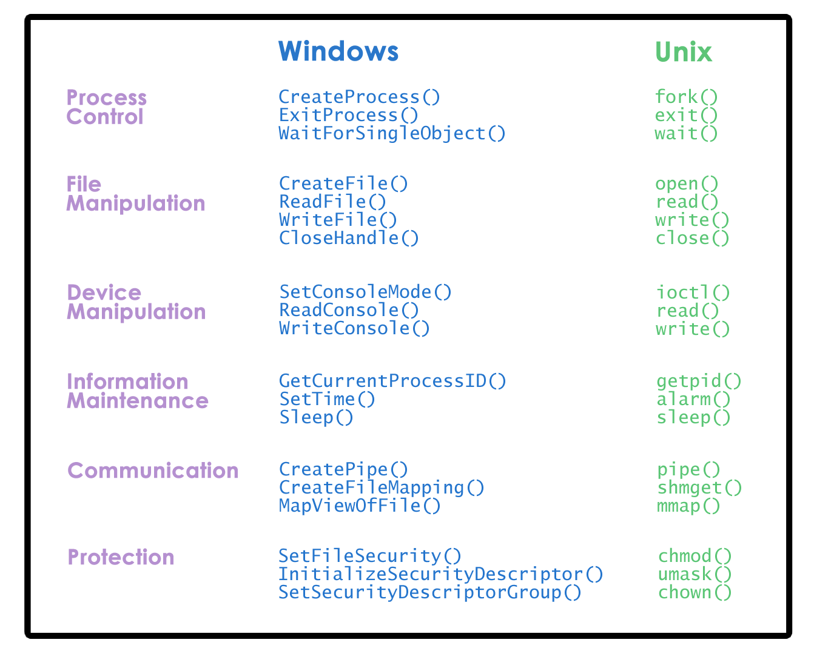

# Introduction to Operating Systems

- OS is a layer of systems software that:
    - Directly has privileged access to underlying hardware
    - Hides hardware complexity
    - Manages hardware on behalf of one of more applications according to some predefined policies
    - Ensures isolation of applications & protects one from another

- Desktop OS:
    - Microsoft Windows
    - UNIX based:
        - Mac OS X (BSD)
        - Linux
    - Embedded OS:
        - Android
        - iOS
        - Symbian

| Abstraction | Mechanism |
|--|--|
|Process, thread|Create, schedule|
|File |Open, write |
|memory page|Allocate, map to process|

- Policies eg: 
    - LRU: Least-recently used
    - EDF: Earliest deadline first

- Memory Management Eg:
    - Abstraction used: Memory page
    - Mechanism: allocate, map to a process
    - Policy: LRU

- Design Principles:
    - Separation of Mechanism & Policy:
        - Implement flexible mechanisms to support many policies
        - Eg: LRU, LFU (least frequently used), random
    - Optimize for the common case
        - Where will the OS be used?
        - What will the user want to execute on that machine?
        - What are the workload requirements?

- User/Kernel Protection Boundary:
    - User-level: unprivileged mode
    - Kernel-level: privileged mode
    - User-Kernel switch is supported by hardware through:
        - Trap instructions
        - System calls
            - Open (file)
            - Send (socket)
            - Mmap (memory)
        - Signals

- To make system calls, an application must:
    - Write arguments
    - Save relevant data at well-defined location
    - Make system call

- User/Kernel Transitions:
    - Hardware supported: Eg - traps on illegal instructions or memory access requiring special privilege
    - Involves number of instructions [eg: ~50-100 ns on a 2GHz machine running Linux]
    - Switches locality: Affects hardware cache
        - Because context switches will swap the data/addresses currently in cache, the performance of applications can benefit or suffer based on how a context switch changes what is in cache at the time they are accessing it.
        - A cache would be considered hot (fire) if an application is accessing the cache when it contains the data/addresses it needs.
        - Likewise, a cache would be considered cold (ice) if an application is accessing the cache when it does not contain the data/addresses it needs -- forcing it to retrieve data/addresses from main memory.

- Windows vs Linux system calls:

- Monolithic OS: 
    - Advantages: 
        - Everything Included
        - Inlining, compile-time optimizations
    - Disadvantages:
        - Customization
        - Portability
        - Manageability
        - Memory footprint
        - Performance

- Modular OS: [Have Modules (interface)]
    - Advantages:
        - Maintainability
        - Smaller footprint
        - Less resources needed
    - Disadvantages:
        - Indirection can impact performance
        - Maintenance can still be an issue

- Microkernel:
    - At OS level, it supports basic services such as to represent an executing application, its address space & context (so a thread)
    - Everything else like databases, file systems, device drivers will run outside OS kernel, at unprivileged level
    - Requires lot of inter-process interactions. Hence, microkernel supports inter-process communication as a core abstraction along with address spaces & threads
    - Advantages:
        - Size
        - Verifiability
    - Disadvantages:
        - Portability
        - Complexity of software development
        - Cost of user/kernel crossing
