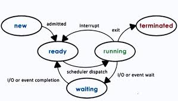
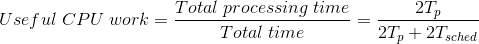

# Processes & Process Management

-   __Application:__ program on disk, flash memory (static entity)

-   __Process:__ State of a program when executing, loaded in memory (active entity)

-   OS abstraction used to encapsulate all of the process state is an address space (a range of addresses from V0 to Vmax ) 

-   Different types of process state will appear in different regions of address space

-   Types of state in a process:    
    -   __Text & data:__ static state when the process first loads
    -   __Heap:__ dynamically created during execution
    -   __Stack:__ grows & shrinks (~ LIFO queue)

-   __Address space:__ in-memory representation of a process (contains virtual addresses used by process)

-   __Page table:__ mapping of virtual to physical addresses

-   __Physical addresses:__ locations in physical memory (such as DRAM)

-   Processes have some portion of their addresses spaces not present in memory, but rather swapped temporarily on disk

-   At a given point of time, CPU needs to know where in instruction sequence a process currently is. It maintains:
    -   Program Counter (PC)
    -   CPU registers
    -   Stack pointer

-   __Process Control Block (PCB):__ A DS that an OS maintains for every one of the processes that it manages. It contains the following:
    -   Process State
    -   Process number
    -   Process counter
    -   Registers
    -   Memory limits
    -   List of open files
    -   Priority
    -   Signal Mask
    -   CPU scheduling info, etc

-   PCB is created when a process is created

-   Certain fields are updated when process state changes

-   Other fields change too frequently

-   Each time a swapping between PCBs (context of one process) is performed by the OS, it is said to perform a "context switch"

-   Context switch is expensive:
    -   Direct costs: number of cycles for load & store instructions
    -   Indirect costs: Cold cache, cache misses

-   Process Lifecycle:

-   Mechanisms for Process Creation:
    -   __Fork:__
        -   Copies parent PCB into new child PCB
        -   Child continues execution at the instruction after fork
    -   __Exec:__
        -   Replace child image
        -   Load new program & start from first instruction

-   Parent of all processes:
    -   In UNIX: `init`
    -   In Android: `zygote`

-   CPU scheduler determines which one of the currently ready processes will be dispatched to the CPU to start running, & how long it should run for

-   OS must
    -   __Preempt:__ interrupt & save current context
    -   __Schedule:__ run scheduler to choose next process
    -   __Dispatch:__ dispatch process & switch into its context efficiently

-     

[Tp = time taken by a process to execute & Tsched = Time taken to schedule a new task]

-   __Timeslice:__ Tp allocated to a process on the CPU

-   Scheduling design decisions:

    -   What are appropriate timeslice values?

    -   Metrics to choose next process to run?

-   Inter Process Communication (IPC):
    -   Transfer data/info between address spaces
    -   Maintain protection & isolation
    -   Message Passing IPC:
        -   OS provides communication channel like shared buffer
        -   Processes:
            -   Write (send)
            -   Read (recv)
        -   Avd: OS manages
        -   Disadv: Overheads
    -   Shared Memory IPC:
        -   OS establishes a shared channel & maps it into each process address space
        -   Processes directly read/write from this memory
        -   Avd: OS is out of the way
        -   Disadv: Re-implement code
    -   Shared memory based IPC is useful only if the cost of mapping memory between the 2 processes (setup cost) can be amortized across a sufficiently large number of messages