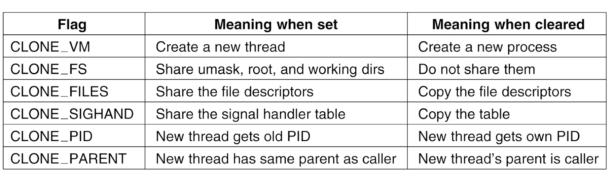

# Thread Design Considerations

-   OS kernel maintains:
    -   Thread abstraction
    -   Scheduling, sync, etc

-   User-level library provides:
    -   Thread abstraction
    -   Scheduling, sync, etv

-   User-level: Single threaded & Kernel-level: Single threaded:
    -   PCB:
        -   Virtual addresses mapping
        -   Stack
        -   Registers

-   User-level: Multithreaded & Kernel-level: Single-threaded:
    -   PCB (same as above)
    -   ULT:
        -   UL thread ID
        -   UL registers
        -   Thread stacks

-   User-level: Multithreaded & Kernel-level: Multithreaded:
    -   ULT (same as previous)
    -   PCB:
        -   Virtual address mappings only
    -   KLT:
        -   Stack
        -   Registers

-   If system has multiple CPUs, we need a structure to represent CPU:
    -   Ptr to current & other threads

-   For systems with multiprocessing & multithreading, PCB is split into:
    -   __Hard process state:__ (relevant for all ULTs executing within a process)
        -   Virtual Address Mappings

    -   __Light process state:__ (relevant for subset of ULTs associated with a KLT)
        -   Signal masks
        -   System call args

-   Rationale for multiple DS:
    -   Smaller DS
    -   Easier to share
    -   On context switch, only save & restore what is needed to change
    -   User-level library need only update portion of state

-   ULT DS in Lightweight Threads:
    -   Not POSIX threads, but similar
    -   Thread creation => thread ID (tid)
        -   Tid => index into table of pointers
        -   Table pointers point to per thread DS
    -   Stack growth => dangerous [Solution: __Red zone__]

-   KLT DS:
    -   Process:
        -   List of kernel-level threads
        -   Virtual address space
        -   User credentials
        -   Signal handlers
    -   LWP:
        -   User level registers
        -   System call arguments
        -   Resource usage info
        -   Signal mask
        -   Similar to ULT, but visible to kernel
        -   Not needed when process not running
    -   KLT:
        -   Kernel level registers
        -   Stack pointer
        -   Scheduling info
        -   Pointers to associated LWP, process, CPU
        -   Information needed even when process in not running
        -   Not swappable
    -   CPU
        -   Current thread
        -   List of KLT
        -   Dispatching & interrupt handling info

-   System calls & special signals allow kernel & ULT library to interact & coordinate
    -   Process jumps to UL library scheduler when:
    -   ULTs explicitly yield
    -   Timer set by UL Library expires
    -   ULTs call library functions like lock/unlock
    -   Blocked thread becomes runnable

-   UL library scheduler:
    -   Runs on ULT operations
    -   Runs on signals from timer on kernel

-   On multiprocessing system, if one thread with a short critical section running on one CPU holds a mutex, & another thread wants to use the same mutex but is running on another CPU, we may be better off spinning the thread rather than picking it, context switching it, & queueing it up on a mutex queue. This is done using "Adaptive" mutexes

-   Instead of destroying threads, reuse them

-   When thread exits,
    -   Put on __death row__
    -   Periodically destroyed by __reaper thread__
    -   Otherwise thread structures/stacks are reused => performance gains

-   __Interrupts:__
    -   Events generated externally by components other than CPU
    -   Determined based on physical platform
    -   Appear asynchronously

-   __Signals:__
    -   Events triggered by CPU & software running on it
    -   Determined based on OS
    -   Appears asynchronously/synchronously

-   Interrupts & signals:
    -   Have unique ID depending on hardware/OS
    -   Can be masked & disabled/suspended via corresponding mask
        -   per-CPU interrupt mask
        -   per-process signal mask
    -   If enabled, trigger corresponding handler
        -   Interrupt handler set for entire system by OS
        -   Signal handlers set on per process basis by process

-   Most systems use Message Signal Interrupts (MSI) on same connect as device to CPU complex to trigger interrupts. Interrupt interrupts thread & now using MSI, it is identified using an interrupt handler table & execution continues from starting address of the corresponding handler code. How interrupts are handled is OS specific

-   Similar Signal Handler Table is used to handle signals. Here, the signal number is OS specific and the handler code is process specific.

-   Default OS actions to handle signals:
    -   Terminate, ignore, terminate & core dump, stop, continue

-   Processes install custom signal handling routines

-   Some synchronous signals:
    -   `SIGSEGV` (access to protected memory)
    -   `SIGFPE` (divide by 0)
    -   `SIGKILL` (kill, id) - directed to specific thread

-   Some asynchronous signals:
    -   `SIGKILL` (kill)
    -   `SIGALARM`

-   When interrupt occurs, PC points to first instruction of handler, but SP (stack pointer) points to stack of original thread which was interrupted. If thread acquired a mutex which is required by the handler, deadlock arises

-   To prevent such deadlocks:
    -   Keep handler code simple => too restrictive
    -   Control interruptions by handler code => use signal/interrupt masks

-   Mask is a sequence of bits where each bit corresponds to specific interrupt/signal. If bit is 0, interrupt/signal is disabled. If one, it is enabled.

-   For the situation mentioned above, when thread acquires a mutex, it sets signal mask for the handler to 0 (disabled) so that the handler won't interrupt the critical section of the thread. It remains disabled. When lock is released, thread resets that mask & the handler code is executed.

-   On multi-CPU system, interrupts can be directed to any CPU that has them enabled
    -   We may set interrupts on just one core => avoids overheads & perturbations on all other cores
    -   There are __IPIs (Inter processor interrupts)__ for relaying the interrupt to the designated CPU later.
    -   In-memory shared queues can also be set which can be accessed from all cores to pass messages, if sending IPIs is undesirable given the overheads

-   Types of signals:
    -   __One shot signals:__
        -   N signals pending == 1 signal pending => Only one execution of handler routine
        -   Handling routine must be re-enabled explicitly
    -   __Real Time Signals:__
        -   If n signals raised, handler is executed n times.

-   Handler can be implemented as a tread, but dynamic thread creation is expensive. Dynamic decision involves:
    -   If handler doesn't lock => execute on interrupted thread's stack
    -   If handler can block => turn into real thread 

-   Optimization: => precreate & preinitialize thread structures for interrupt routines supported

-   Interrupt handling routines have:
    -   Top half: fast, non-blocking, min. amt. of processing
    -   Bottom half: arbitrary complexity

-   Overheads of such implementation is ~40 instruction per interrupt, but saves 12 instructions per mutex (no changes in interrupt mask). Since there are way fewer interrupts than mutex lock/unlock, operations, it is a performance gain overall

-   Handling Signals:
    -   __Case 1: ULT mask = 1 & KLT mask = 1__
        -   When signal occurs, kernel sees that signal mask is enabled & KLT interrupts the ULT running on top of it
    -   __Case 2: KLT mask = 1; ULT mask = 0 (on top of KLT) & another ULT mask = 1__
        -   When signal occurs, Kernel thinks process overall can handle it 
        -   Kernel sees that process overall can handle the signal
        -   ULT library knows that a thread in queue mas mask enabled
        -   We can have a special library routine that wrap signal handling routines, which sees masks of all ULTs.
        -   The library routine can invoke the library scheduler to schedule the second thread in case signal occurs
    -   __Case 3: KLT mask = 1; ULT mask = 0__
        -   ULT library issues a system call to KLT asking it to disable the KL signal mask
        -   If there are more KLTs with signal mask enabled and their corresponding ULT have signal masks disabled, this ULT will issue a signal for the entire process again. The KLT pick it up and passes it to the ULT, where the library again handles the signal by issuing a system call to KLT to disable the KL signal mask, and so on.

-   Main execution context abstraction on a KLT in Linux: task

-   To create a task, use `clone(function, stack_ptr, sharing_flags, args)`

-   `fork()` in Linux is implemented internally using `clone()` with all flags cleared

-   `fork()` has very different implementation in Linux compared to POSIX `fork()`

-   Current implementation of Linux threads: __Native POSIX Threads Library (NPTL)__
    -   1:1 model
    -   Kernel sees each ULT
    -   Kernel traps cheaper
    -   More resources: memory, large range of IDs, etc