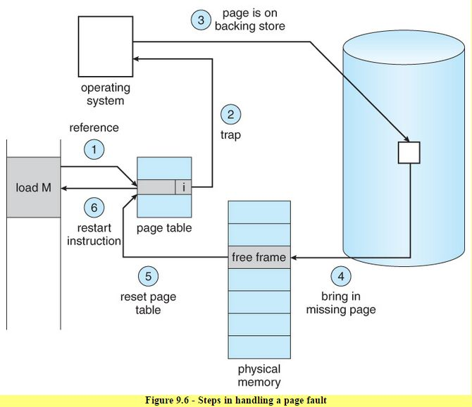

# Memory Management

-   Each address identifies a single byte [8 bits]

-   Memory Management goals:
    -   Allocate: allocation, replacement
    -   Arbitrate: address translation  & validation

-   __Page-based memory management:__ [Dominant mechanism]
    -   Virtual address space is subdivided into fixed-sized segments called __pages__
    -   Physical memory is divided into __page-frames__ of same size
    -   Allocate => pages -> page frames
    -   Arbitrate => page tables

-   __Segment-based memory management:__
    -   Flexibly sized __segments__ that can be mapped to regions in physical memory as well as swapped in/out of physical memory
    -   Arbitration done by segment registers

-   Hardware Support:
    -   __Memory management Unit [MMU]:__
        -   Every CPU package has an MMU
        -   Translate virtual addresses to physical addresses
        -   Report __faults__: illegal access, permission, not present in mm
    -   Registers:
        -   Pointers to page tables
        -   Base & limit size, number of segments
    -   Cache - __Translation Lookaside Buffer [TLB]:__
        -   Store valid VA->PA translations

-   __Page Table:__
    -   Since size of virtual memory pages & physical memory page frames is the same, we need to store only mappings of first entries of each page & the others in the same page can be referenced by the corresponding offset
    -   Page Tables store virtual memory addresses as __VPN [Virtual Page Number]__ followed by an offset
    -   It translates VPN to __Physical Frame Number [PFN]__ & uses the offset to reference actual physical memory
    -   Physical memory for an array in virtual memory is allocated only at initialization [allocation on __first touch__]
    -   Unused pages are _reclaimed_
    -   Page table also stores  a __valid bit__ for every mapping to indicate if the page is in memory
    -   Page tables are maintained per process
    -   Every page frame entry has the following flags:
        -   "P"resent [valid/invalid]
        -   "D"irty [written into]
        -   "A"ccessed [for read/write]
        -   Protection bits: R, W, X
    -   __Page Fault:__ generated if a physical memory cannot be accessed:
        -   Generate error code on kernel stack & trap into kernel 
        -   This generates a page fault handler to determine  action based on error code & faulting address
            -   Bring page from disk to memory
            -   Protection error
    -   Page table assumes an entry per VPN, regardless of whether the corresponding memory is in use or not

-   __Hierarchical Page Tables:__
    -   Outer/Top page table == page table directory
    -   Internal page table == only for valid virtual memory regions
    -   On `malloc`, new internal page table is allocated
    -   Important for 64-bit architectures => larger & more sparse
        -   Larger gaps => could save internal page table components
    -   Tradeoff:
        -   Smaller internal page tables => granularity of access
        -   More memory access for translation => more latency

-   __Inverted Page Tables:__
    -   Why? => number of physical addresses are much smaller in size than number of virtual addresses
    -   Problem: we need to perform a linear search on the page table entries as physical memory is not ordered
    -   We use TLB to cache recent & frequent mappings to avoid this search
    -   IPTs are supplemented with Hashing Page Tables:
        -   Part of the address is hashed & stored in a hash table
        -   This points to a linked list of possible matches to the address to narrow down the search space

-   __Segmentation:__
    -   __Segments:__ Arbitrary granularity (logically meaningful components of address space like code, heap, data, stacke, etc)
    -   Logical address contains a segment selector & offset
    -   Segment selector is used with a descriptor table to get information about physical address of segment.
    -   This is combined with offset to get linear address of memory reference
    -   Purely, segments can represent contiguous physical memory where:
        -   Segment size = segment base + limit registers
    -   Segmentation + Paging used in practice

    

-   Offsets in page table entries determine the page size
    -   10 bit offset => 1kB page size
    -   12-bit offset => 4kB page size

-   Linux/x86 default page size: 4kB [Can be larger 2MB (large) & 1GB (huge)]

-   Larger page sizes reduce number of page table entries & increase TLB hits but can cause internal fragmentation => wasting memory

-   __Memory Allocator:__
    -   Determines VA -> PA mapping
    -   Kernel-level allocators - kernel state, static process state
    -   User-level allocators - dynamic process state (heap), `malloc`/`free`

-   __External fragmentation:__ When we have holes of free memory but they not contiguous & hence, requests for larger contiguous memory allocations can't be satisfied

-   __Linux Kernel Allocators:__

    -   __Buddy Allocator:__
        -   Start with 2x area
        -   On request, subdivide into 2 chunks of 2x-1 recursively and find smallest 2k chunk that satisfies the request
        -   Fragmentation still there, but on free:
            -   Check buddy to see if you can aggregate into a larger chunk
            -   Aggregation is faster
        -   Addresses are of the form 2k so that addresses of each of the buddies differ at most by 1 bit, making it easier to do check while aggregating buddies
    -   __Slab Allocator:__
        -   Builds custom object caches on top of slabs
        -   Slabs represent contiguously allocated physical memory
        -   Kernel pre-creates caches for different objects when it starts
        -   When object actually comes, the allocator goes to the cached slab & allocates it to the object
        -   If not entry is available, the kernel will create another slab & preallocate an additional portion of contiguous memory to be managed by slab allocator
        -   Avoids internal fragmentation

-   __Demand paging:__ pages swapped in/out of memory & a swap partition (on disk, etc)

-   If we want  page to be present in memory or maintain the same physical address for its entire lifetime, we have to __pin__ the page => swapping disabled

-   When should pages be swapped out?
    -   page(out) daemon
    -   When memory usage is above threshold [__high watermark__]
    -   When CPU usage is below threshold [__low watermark__]

-   Which pages to swap out?
    -   Pages that won't be used in future [how to find?]
        -   Least Recently Used [uses Access bit to track if a page is referenced]
    -   Pages that don't need to be written out to disk
        -   Can rely on the _Dirty bit_
    -   Avoid non-swappable pages

-   Variation of LRU - __Second Chance policy__

-   __Copy-on-Write (CoW)__ mechanism:
    -   On process creation:
        -   Instead of copying entire parent space, map the new VA to original page
        -   Write-protect the original page
    -   If only read, save memory  & time to copy
    -   On write:
        -   Page fault & copy
        -   Pay copy cost only when necessary

-   __Checkpointing:__
    -   Failure & recovery management technique
    -   Periodically save process state
    -   Failure may be unavoidable, but can restart from checkpoint for faster recovery
    -   Simple approach:
        -   Pause & copy
    -   Better approach [utilize hardware support]:
        -   Write-protect & copy everything once
        -   Copy diffs of "dirtied" pages for incremental checkpoint
        -   Rebuild from multiple diffs or in the background the diffs can be aggregated
    -   Debugging:
        -   __Rewind-replay (RR)__
        -   __Rewind:__ restart from a checkpoint
        -   Gradually go back to older checkpoints until error is found
    -   Migration:
        -   Continue on another machine
        -   For disaster recovery & consolidation
        -   Implemented using repeated checkpoints in a fast loop until pause-and-copy becomes acceptable (unavoidable)