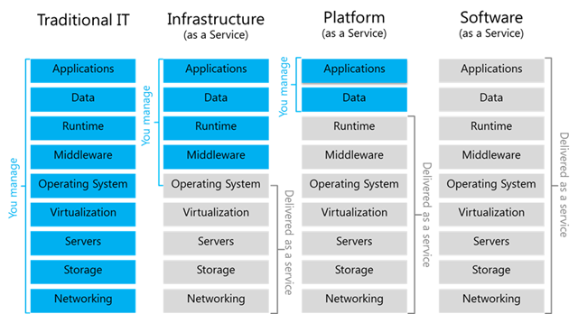

# Datacenter Technologies

- Internet Services:
    - Any type of service provided via web interface
    - Components:
        - Presentation [Static content]
        - Business Logic [Dynamic Content]
        - Database Tier [Data Store]
    - Not necessary that separate components ru on separate machines
    - __Middleware:__ Supporting, integrative or value-added software technologies
    - In multi-process configurations, some form of IPC is used (RPC/RMI/Shared memory)
    - Architecture:
        - _Scale out_ architecture: multi-process, multi-node
        - _Boss-worker_: Front-end distributes requests to nodes
        - _All equal_: All nodes are execute any possible step in request processing for any request [__functionally homogeneous__]
        -_Specialized Nodes_: Nodes execute some specific step(s) in request processing or for just for some specific requests [__functionally heterogeneous__]
    - Functionally Homogeneous:
        - Keeps frontend simple (spray requests to nodes in round-robin fashion or by keeping track of CPU load per node)
        - Doesn't mean that every node must have all the data; Just that each node can get to all the data
        - Low opportunity to benefit from caches
        - Increase in request rates can be catered to by adding more processes, servers & storage (simple management)
    - Functionally Heterogeneous:
        - Data is not accessible uniformly by all nodes
        - Benefit of locality & caching
        - More complex frontend & management
        Some nodes may become hot spots with long backlog of requests
    
- Traditional Approach: 
    - Buy & configure resources
    - Determine capacity based on expected demand (peak)
    - When demand exceeds capacity:
        - Lost opportunity
        - Dropped requests

- Ideal Cloud:
    - Capacity scales elastically ith demand
    - Scaling is instantaneous (both up & down)
    - Cost is proportional to demand
    - All this happens automatically
    - Can access anytime, anywhere
    - May not _own_ resources

- Cloud Computing Requirements:
    - On-demand, elastic resources & services
    - Fine-grained pricing based on usage
    - Professionally managed & hosted
    - API-based access

- Cloud Computing Overview:
    - Shared resources (infrastructure & software/services)
    - APIs for access & configuration (web-based, libraries, CLI-based)
    - Billing & Accounting services:
        - Many models:  Spot, reservation
        - Typically discrete quantities: tiny, medium, x-large
    - Managed by cloud provider
    - __Law of Large Numbers:__ Although per customer there is a large variation in resource need, average across customers is roughly constant
    - __Economies of Scale:__ Unit cost of providing resources/services drops at _bulk_
    - NIST defines Cloud Computing as: _a model for enabling ubiquitous, convenient, on-demand network access to a shared pool of configurable computing resources (e.g., networks, servers, storage, applications, and services) that can be rapidly provisioned and released with minimal management effort or service provider interaction_

- Cloud Deployment Models:
    - Public: Third-party customers/tenants
    - Private: Leverage technology internally
    - Hybrid: Private cloud is interfaced with a Public resources for failovers, additional redundancy, dealing with spikes or testing
    - Community: Used by certain type of users

- Cloud Service Models:

- Cloud Enabling Technologies:
    - Virtualization: To address need to provide _fungible_ resources & dynamically repurposed
    - Resource provisioning (scheduling) [Such as [Mesos](https://mesos.apache.org/) & [Yarn](https://www.geeksforgeeks.org/hadoop-yarn-architecture/)]
    - Big Data processing (Hadoop MapReduce, Spark)
    - Big Data storage
    - Software-defined networking, storage, datacenters
    - Monitoring ([Flume](https://flume.apache.org/FlumeUserGuide.html), CloudWatch)